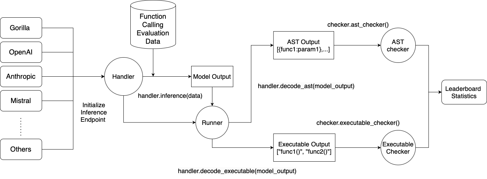

# Berkeley Function Calling Leaderboard (BFCL)

## Table of Contents

- [Berkeley Function Calling Leaderboard (BFCL)](#berkeley-function-calling-leaderboard-bfcl)
  - [Table of Contents](#table-of-contents)
  - [Introduction](#introduction)
  - [Installation \& Setup](#installation--setup)
    - [Basic Installation](#basic-installation)
    - [Extra Dependencies for Self-Hosted Models](#extra-dependencies-for-self-hosted-models)
    - [Setting up Environment Variables](#setting-up-environment-variables)
  - [Running Evaluations](#running-evaluations)
    - [Generating LLM Responses](#generating-llm-responses)
      - [Selecting Models and Test Categories](#selecting-models-and-test-categories)
      - [Output and Logging](#output-and-logging)
      - [For API-based Models](#for-api-based-models)
      - [For Locally-hosted OSS Models](#for-locally-hosted-oss-models)
        - [For Pre-existing OpenAI-compatible Endpoints](#for-pre-existing-openai-compatible-endpoints)
      - [(Alternate) Script Execution for Generation](#alternate-script-execution-for-generation)
    - [Evaluating Generated Responses](#evaluating-generated-responses)
      - [Output Structure](#output-structure)
      - [(Optional) WandB Evaluation Logging](#optional-wandb-evaluation-logging)
      - [(Alternate) Script Execution for Evaluation](#alternate-script-execution-for-evaluation)
  - [Contributing \& How to Add New Models](#contributing--how-to-add-new-models)
  - [Additional Resources](#additional-resources)

---

## Introduction

We introduce the Berkeley Function Calling Leaderboard (BFCL), the **first comprehensive and executable function call evaluation** dedicated to assessing Large Language Models' (LLMs) ability to invoke functions. Unlike previous evaluations, BFCL accounts for various forms of function calls, diverse scenarios, and executability.

💡 Read more in our blog posts:

- [BFCL v1 (original) Blog Post](https://gorilla.cs.berkeley.edu/blogs/8_berkeley_function_calling_leaderboard.html)
- [BFCL v2 (live dataset) Blog Post](https://gorilla.cs.berkeley.edu/blogs/12_bfcl_v2_live.html)
- [BFCL v3 (multi-turn) Blog Post](https://gorilla.cs.berkeley.edu/blogs/13_bfcl_v3_multi_turn.html)

🦍 See the live leaderboard at [Berkeley Function Calling Leaderboard](https://gorilla.cs.berkeley.edu/leaderboard.html#leaderboard)



---

## Installation & Setup

### Basic Installation

```bash
# Create a new Conda environment with Python 3.10
conda create -n BFCL python=3.10
conda activate BFCL

# Clone the Gorilla repository
git clone https://github.com/ShishirPatil/gorilla.git

# Change directory to the `berkeley-function-call-leaderboard`
cd gorilla/berkeley-function-call-leaderboard

# Install the package in editable mode
pip install -e .
```

### Extra Dependencies for Self-Hosted Models

For locally hosted models, choose one of the following backends, ensuring you have the right GPU and OS setup:

`sglang` is *much faster* than `vllm` but only supports newer GPUs with SM 80+ (Ampere etc).
If you are using an older GPU (T4/V100), you should use `vllm` instead as it supports a much wider range of GPUs.

**Using `vllm`:**
```bash
pip install -e .[oss_eval_vllm]
```

**Using `sglang`:**
```bash
pip install -e .[oss_eval_sglang]
```

*Optional:* If using `sglang`, we recommend installing `flashinfer` for speedups. Find instructions [here](https://docs.flashinfer.ai/installation.html).

### Setting up Environment Variables

We store environment variables in a `.env` file. We have provided a example `.env.example` file in the `gorilla/berkeley-function-call-leaderboard` directory. You should make a copy of this file, and fill in the necessary values.

```bash
cp .env.example .env
# Fill in necessary values in `.env`
```

If you are running any proprietary models, make sure the model API keys are included in your `.env` file. Models like GPT, Claude, Mistral, Gemini, Nova, will require them.

---

## Running Evaluations

### Generating LLM Responses

#### Selecting Models and Test Categories

- `MODEL_NAME`: For available models, please refer to [SUPPORTED_MODELS.md](./SUPPORTED_MODELS.md). If not specified, the default model `gorilla-openfunctions-v2` is used.
- `TEST_CATEGORY`: For available test categories, please refer to [TEST_CATEGORIES.md](./TEST_CATEGORIES.md). If not specified, all categories are included by default.

You can provide multiple models or test categories by separating them with commas. For example:

```bash
bfcl generate --model claude-3-5-sonnet-20241022-FC,gpt-4o-2024-11-20-FC --test-category simple,parallel,multiple,multi_turn
```

#### Output and Logging

- All generated model responses are stored in `./result/` folder, organized by model and test category: `result/MODEL_NAME/BFCL_v3_TEST_CATEGORY_result.json`
- To use a custom directory for the result file, specify using `--result-dir`; path should be relative to the `berkeley-function-call-leaderboard` root folder,

An inference log is included with the model responses to help analyze/debug the model's performance, and to better understand the model behavior. For more verbose logging, use the `--include-input-log` flag. Refer to [LOG_GUIDE.md](./LOG_GUIDE.md) for details on how to interpret the inference logs.

#### For API-based Models

```bash
bfcl generate --model MODEL_NAME --test-category TEST_CATEGORY --num-threads 1
```

- Use `--num-threads` to control the level of parallel inference. The default (`1`) means no parallelization.
- The maximum allowable threads depends on your API’s rate limits.

#### For Locally-hosted OSS Models

```bash
bfcl generate \
  --model MODEL_NAME \
  --test-category TEST_CATEGORY \
  --backend {vllm|sglang} \
  --num-gpus 1 \
  --gpu-memory-utilization 0.9 \
  --local-model-path /path/to/local/model   # ← optional
```

- Choose your backend using `--backend vllm` or `--backend sglang`. The default backend is `vllm`.
- Control GPU usage by adjusting `--num-gpus` (default `1`, relevant for multi-GPU tensor parallelism) and `--gpu-memory-utilization` (default `0.9`), which can help avoid out-of-memory errors.
- `--local-model-path` (optional): Point this flag at a directory that already contains the model’s files (`config.json`, tokenizer, weights, etc.). Use it only when you’ve pre‑downloaded the model and the weights live somewhere other than the default `$HF_HOME` cache.

##### For Pre-existing OpenAI-compatible Endpoints

If you have a server already running (e.g., vLLM in a SLURM cluster), you can bypass the vLLM/sglang setup phase and directly generate responses by using the `--skip-server-setup` flag:

```bash
bfcl generate --model MODEL_NAME --test-category TEST_CATEGORY --skip-server-setup
```

In addition, you should specify the endpoint and port used by the server. By default, the endpoint is `localhost` and the port is `1053`. These can be overridden by the `VLLM_ENDPOINT` and `VLLM_PORT` environment variables in the `.env` file:

```bash
VLLM_ENDPOINT=localhost
VLLM_PORT=1053
```

#### (Alternate) Script Execution for Generation

For those who prefer using script execution instead of the CLI, you can run the following command:

```bash
# Make sure you are inside the `berkeley-function-call-leaderboard` directory
python openfunctions_evaluation.py --model MODEL_NAME --test-category TEST_CATEGORY
```

When specifying multiple models or test categories, separate them with **spaces**, not commas. All other flags mentioned earlier are compatible with the script execution method as well.

### Evaluating Generated Responses

**Important:** You must have generated the model responses before running the evaluation.

Once you have the results, run:

```bash
bfcl evaluate --model MODEL_NAME --test-category TEST_CATEGORY
```

The `MODEL_NAME` and `TEST_CATEGORY` options are the same as those used in the [Generating LLM Responses](#generating-llm-responses) section. For details, refer to [SUPPORTED_MODELS.md](./SUPPORTED_MODELS.md) and [TEST_CATEGORIES.md](./TEST_CATEGORIES.md).

If in the previous step you stored the model responses in a custom directory, you should specify it using the `--result-dir` flag; path should be relative to the `berkeley-function-call-leaderboard` root folder.

> Note: For unevaluated test categories, they will be marked as `N/A` in the evaluation result csv files.
> For summary columns (e.g., `Overall Acc`, `Non_Live Overall Acc`, `Live Overall Acc`, and `Multi Turn Overall Acc`), the score reported will treat all unevaluated categories as 0 during calculation.

#### Output Structure

Evaluation scores are stored in `./score/`, mirroring the structure of `./result/`: `score/MODEL_NAME/BFCL_v3_TEST_CATEGORY_score.json`

- To use a custom directory for the score file, specify using `--score-dir`; path should be relative to the `berkeley-function-call-leaderboard` root folder.

Additionally, four CSV files are generated in `./score/`:

- `data_overall.csv` – Overall scores for each model. This is used for updating the leaderboard.
- `data_live.csv` – Detailed breakdown of scores for each Live (single-turn) test category.
- `data_non_live.csv` – Detailed breakdown of scores for each Non-Live (single-turn) test category.
- `data_multi_turn.csv` – Detailed breakdown of scores for each Multi-Turn test category.

#### (Optional) WandB Evaluation Logging

If you'd like to log evaluation results to WandB artifacts:

```bash
pip install -e.[wandb]
```

Mkae sure you also set `WANDB_BFCL_PROJECT=ENTITY:PROJECT` in `.env`.

#### (Alternate) Script Execution for Evaluation

For those who prefer using script execution instead of the CLI, you can run the following command:

```bash
# Make sure you are inside the `berkeley-function-call-leaderboard/bfcl/eval_checker` directory
cd bfcl/eval_checker
python eval_runner.py --model MODEL_NAME --test-category TEST_CATEGORY
```

When specifying multiple models or test categories, separate them with **spaces**, not commas. All other flags mentioned earlier are compatible with the script execution method as well.

## Contributing & How to Add New Models

We welcome contributions! To add a new model:

1. Review `bfcl/model_handler/base_handler.py` and/or `bfcl/model_handler/local_inference/base_oss_handler.py` (if your model is hosted locally).
2. Implement a new handler class for your model.
3. Update `bfcl/constants/model_config.py`.
4. Submit a Pull Request.

For detailed steps, please see the [Contributing Guide](./CONTRIBUTING.md).

---

## Additional Resources

- [Gorilla Discord](https://discord.gg/grXXvj9Whz) (`#leaderboard` channel)
- [Project Website](https://gorilla.cs.berkeley.edu/)

All the leaderboard statistics, and data used to train the models are released under Apache 2.0.
Gorilla is an open source effort from UC Berkeley and we welcome contributors.
Please email us your comments, criticisms, and questions. More information about the project can be found at [https://gorilla.cs.berkeley.edu/](https://gorilla.cs.berkeley.edu/)
