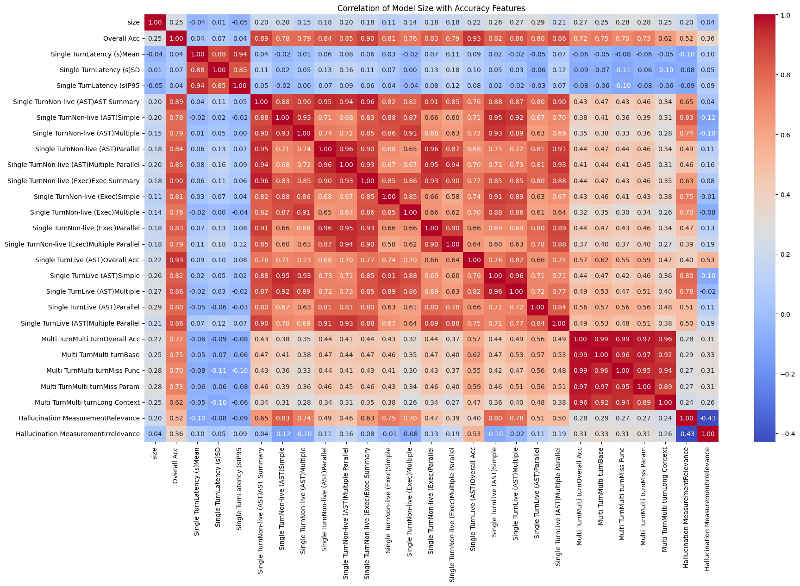

# Model Size vs. Accuracy Features Analysis

## Overview
This folder analyzes the relationship between **model size** and various **accuracy-related features** using data extracted from the leaderboard. The data is preprocessed, filtered, and analyzed to compute correlations between model size and selected accuracy features. Additionally, correlations is visualized using heatmaps.

## Data Preparation
- The dataset is extracted from the leaderboard. saved as a csv file
- Rows containing **"Proprietary"** in the **License** column are removed. (to limit those models with unknown size.)
- Correlation analysis is calculated on **numerical columns** (Model Size + Accuracy Features).
- Code is released as google colab notebook

## Correlation Analysis

