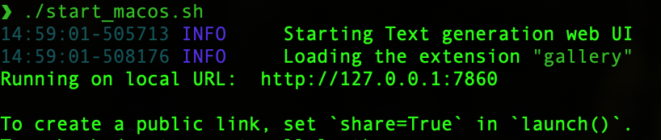
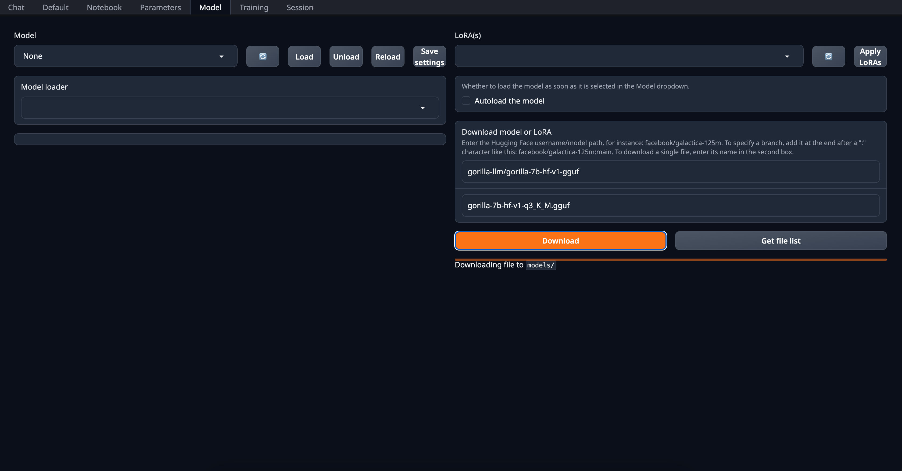
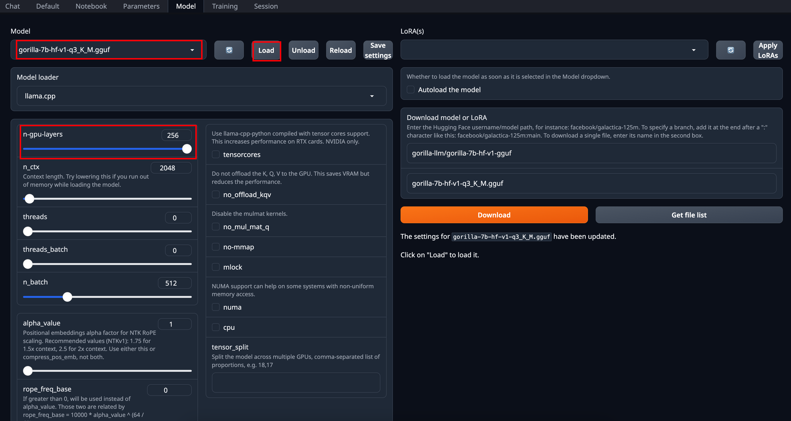
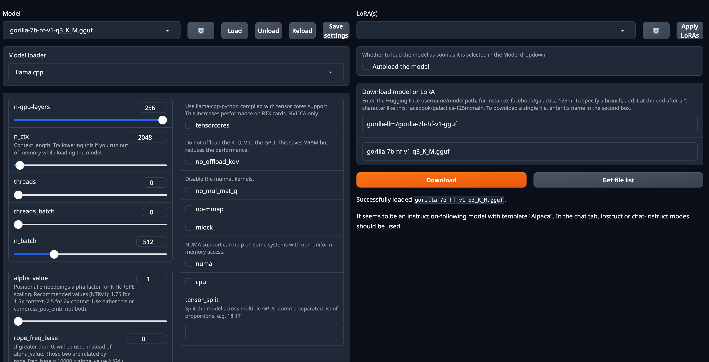
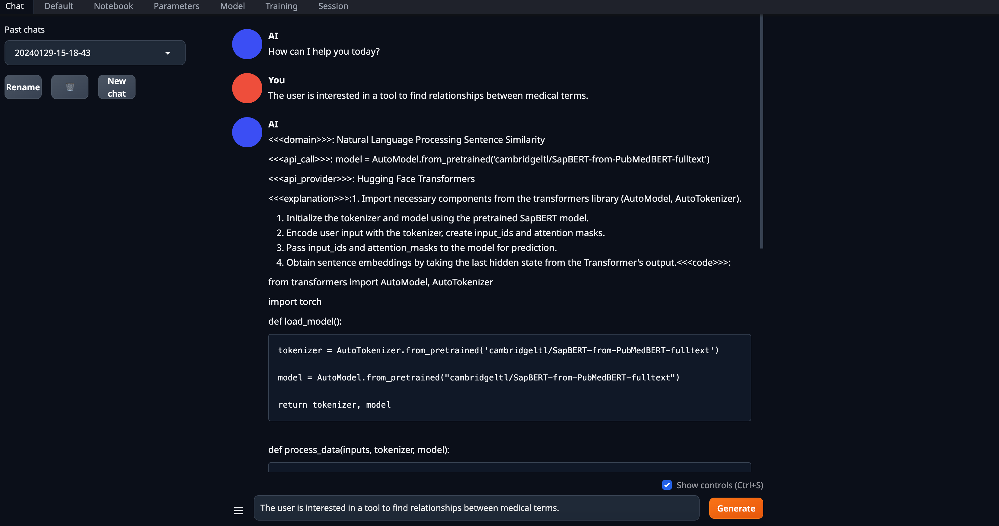

# Gorilla Inference


## Get Started

You can either run Gorilla through our hosted [](https://colab.research.google.com/drive/1DEBPsccVLF_aUnmD0FwPeHFrtdC0QIUP?usp=sharing) or [chat with it using cli](#inference-using-cli). We also provide instructions for [evaluating batched prompts](#optional-batch-inference-on-a-prompt-file). Here, are the instructions to run it locally.

New: We release `gorilla-mpt-7b-hf-v0` and `gorilla-falcon-7b-hf-v0` - two Apache 2.0 licensed models (commercially usable). 

`gorilla-7b-hf-v0` is the first set of weights we released :tada: It chooses from 925 HF APIs in a 0-shot fashion (without any retrieval). Update: We released `gorilla-7b-th-v0` with 94 (exhaustive) APIs from Torch Hub and `gorilla-7b-tf-v0` with 626 (exhaustive) APIs from Tensorflow. In spirit of openness, we do not filter, nor carry out any post processing either to the prompt nor response :gift: Keep in mind that the current `gorilla-7b-*` models do not have any generic chat capability.  We do have a model with all the 1600+ APIs which also has chat capability, which we release slowly to accommodate server demand. 

All gorilla weights hosted at [https://huggingface.co/gorilla-llm/](https://huggingface.co/gorilla-llm/). 

### Install Dependencies

You should install dependencies using the following command: 

```bash
conda create -n gorilla python=3.10
conda activate gorilla
pip install -r requirements.txt
```

We release the weights for [`gorilla-mpt-7b-hf-v0`](https://huggingface.co/gorilla-llm/gorilla-mpt-7b-hf-v0) and [`gorilla-falcon-7b-hf-v0`](https://huggingface.co/gorilla-llm/gorilla-falcon-7b-hf-v0) on Huggingface. You can directly download them! For the llama-finetuned models we release the weights as a delta to be compliant with the LLaMA model license. You can apply the delta weights using the following commands below: 

### Downloading Gorilla Delta Weights

We release the delta weights of Gorilla to comply with the LLaMA model license. You can prepare the Gorilla weights using the following steps: 

1. Get the original LLaMA weights using the link [here](https://huggingface.co/docs/transformers/main/model_doc/llama). 
2. Download the Gorilla delta weights from our [Hugging Face](https://huggingface.co/gorilla-llm/gorilla-7b-hf-delta-v0).

### Applying Delta Weights

Run the following python command to apply the delta weights to your LLaMA model: 

```python
python3 apply_delta.py 
--base-model-path path/to/hf_llama/ 
--target-model-path path/to/gorilla-7b-hf-v0 
--delta-path path/to/models--gorilla-llm--gorilla-7b-hf-delta-v0
```

### 1. Inference using CLI

Simply run the command below to start chatting with Gorilla: 

```bash 
python3 serve/gorilla_cli.py --model-path path/to/gorilla-7b-{hf,th,tf}-v0
```

For the falcon-7b model, you can use the following command: 

```bash
python3 serve/gorilla_falcon_cli.py --model-path path/to/gorilla-falcon-7b-hf-v0
```

> Add "--device mps" if you are running on your Mac with Apple silicon (M1, M2, etc)


### 2. Batch Inference on a Prompt File

After downloading the model, you need to make a jsonl file containing all the question you want to inference through Gorilla. Here is [one example](https://github.com/ShishirPatil/gorilla/blob/main/inference/example_questions/example_questions.jsonl): 

```
{"question_id": 1, "text": "I want to generate image from text."}
{"question_id": 2, "text": "I want to generate text from image."}
```

After that, using the following command to get the results: 

```bash
python3 gorilla_eval.py --model-path path/to/gorilla-7b-hf-v0
--question-file path/to/questions.jsonl
----answer-file path/to/answers.jsonl
```

You could use your own questions and get Gorilla responses. We also provide a set of [questions](https://github.com/ShishirPatil/gorilla/tree/main/gorilla/eval/eval-data/questions/huggingface) that we used for evaluation.

### 3. Local Inference of Quantized Models

K-quantized gorilla models can be found on [Huggingface](https://huggingface.co/gorilla-llm): [Llama-based](https://huggingface.co/gorilla-llm/gorilla-7b-hf-v1-gguf), [MPT-Based](https://huggingface.co/gorilla-llm/gorilla-mpt-7b-hf-v0-gguf), [Falcon-Based](https://huggingface.co/gorilla-llm/gorilla-falcon-7b-hf-v0-gguf)

K-quantized `gorilla-openfunctions-v0` and `gorilla-openfunctions-v1` models can be found on [Huggingface](https://huggingface.co/gorilla-llm): [`gorilla-openfunctions-v0-gguf`](https://huggingface.co/gorilla-llm/gorilla-openfunctions-v0-gguf), [`gorilla-openfunctions-v1-gguf`](https://huggingface.co/gorilla-llm/gorilla-openfunctions-v1-gguf)

For an in depth walkthrough on how this quantization was done, follow the tutorial in 
this [](https://colab.research.google.com/drive/1JP_MN-J1rODo9k_-dR_9c9EnZRCfcVNe?usp=sharing). This tutorial is a fully self-contained space to see an under-the-hood walkthrough of the quantization pipeline (using llama.cpp) and to test out your own prompts with different quantized versions of Gorilla. The models don't take up local space and utilize a CPU runtime. 

Running local inference with Gorilla on a clean interface is simple. Follow the instructions below to set up [text-generation-webui](https://github.com/oobabooga/text-generation-webui), add your desired models, and run inference. 


My specs, M1 MacBook Air 2020
```
  Model Name: MacBook Air
  Model Identifier:	MacBookAir10,1
  Model Number:	Z125000NMCH/A
  Chip:	Apple M1
  Total Number of Cores: 8 (4 performance and 4 efficiency)
  Memory: 16 GB
  System Firmware Version: 10151.61.4
  OS Loader Version: 10151.61.4
```

Step 1: Clone [text-generation-webui](https://github.com/oobabooga/text-generation-webui), a Gradio web UI for Large Language Models. It supports transformers, GPTQ, AWQ, EXL2, llama.cpp (GGUF), and Llama models. It hides many complexities of llama.cpp and has a well defined interface that is easy to use.

`git clone https://github.com/oobabooga/text-generation-webui.git`

Step 2: Follow [text-generation-webui](https://github.com/oobabooga/text-generation-webui) instructions to run the application locally.
1. Go to the cloned folder
2. `./start_macos.sh` and it will output the following 
3. Open a browser and go to url `http://127.0.0.1:7860/` as an example. 


Step 3: Select the quantization method you want to use, download the quantized model and run the inference on the quantized Gorilla models. 

1. Here, we can go to `Model` and there is `Download model or LoRA`. For example, we want to get the q3_K_M gguf quantized model for `gorilla-7b-hf-v1`, you would input `gorilla-llm/gorilla-7b-hf-v1` and filename as `gorilla-7b-hf-v1-q3_K_M` and click `Download`. It would say Downloading file to `models/`. 
2. After downloading the model, you select the Model, `gorilla-7b-hf-v1-q3_K_M` for demonstration, and click `Load`. For settings, if you have laptop GPU available, increasing `n-gpu-layers` accelerates inference. 
3. After loading, it will give a confirmation message as following. 
4. Then go to `Chat` page, use default setting for llama based quantized models, 
5. *Real-time inference* video demo


### 4. Private Inference using Gorilla hosted endpoint on Replicate

This section provides a guide for setting up a private inference endpoint for a Gorilla model hosted on Replicate, a cloud platform for running machine learning models. Replicate offers a secure and scalable alternative to the publicly hosted zanino.berkeley.edu endpoint, enabling private and controlled model deployment. Replicate's open source Cog tool is used for containerizing and deploying the Gorilla model, which streamlines the process of turning Gorilla models into scalable, production-ready services.

To install Cog, run the following command:
```bash
sudo curl -o /usr/local/bin/cog -L https://github.com/replicate/cog/releases/latest/download/cog_`uname -s`_`uname -m`
sudo chmod +x /usr/local/bin/cog
```

To configure Gorilla for use with Cog, the `cog.yaml` file is used. This file defines system requirements, Python package dependencies, and more. Below is the `cog.yaml` file for Gorilla models:

```yaml
build:
  gpu: true
  python_version: "3.10"
  python_packages:
    - "torch==2.0.1"
    - "transformers==4.28.1"
    - "huggingface-hub==0.14.1"
    - "sentencepiece==0.1.99"
    - "accelerate==0.19.0"
    - "einops"
predict: "predict.py:Predictor"
```
Note: Cog uses the nvidia-docker base image, which automatically figures out what versions of CUDA and cuDNN to use based on the version of Python and PyTorch that you specify.

`predict.py` is used to describe the prediction interface for Gorilla. It includes the implementation of the `Predictor` class, which defines how the model is set up and how predictions are generated. Below is the content of the `predict.py` file:

```python
from cog import BasePredictor, Input
import torch
from transformers import AutoTokenizer, AutoModelForCausalLM, pipeline

def get_prompt(user_query: str) -> str:
    """
    Generates a conversation prompt based on the user's query.

    Parameters:
    - user_query (str): The user's query.

    Returns:
    - str: The formatted conversation prompt.
    """
    return f"USER: <<question>> {user_query}\nASSISTANT: "

class Predictor(BasePredictor):
    def setup(self):
        """
        Load the model into memory to make running multiple predictions efficient.
        Sets up the device, model, tokenizer, and pipeline for text generation.
        """
        # Device setup
        self.device = "cuda:0" if torch.cuda.is_available() else "cpu"
        self.torch_dtype = torch.float16 if torch.cuda.is_available() else torch.float32

        # Model and tokenizer setup
        model_id = "gorilla-llm/gorilla-falcon-7b-hf-v0"
        self.tokenizer = AutoTokenizer.from_pretrained(model_id, trust_remote_code=True)
        self.model = AutoModelForCausalLM.from_pretrained(
            model_id, 
            torch_dtype=self.torch_dtype, 
            low_cpu_mem_usage=True, 
            trust_remote_code=True
        )

        # Move model to device
        self.model.to(self.device)

        # Pipeline setup
        self.pipe = pipeline(
            "text-generation",
            model=self.model,
            tokenizer=self.tokenizer,
            max_new_tokens=256,
            batch_size=16,
            torch_dtype=self.torch_dtype,
            device=self.device,
        )

    def predict(self, user_query: str = Input(description="User's query")) -> str:
        """
        Run a single prediction on the model using the provided user query.

        Parameters:
        - user_query (str): The user's query for the model.

        Returns:
        - str: The model's generated text based on the query.
        """
        prompt = get_prompt(user_query)
        output = self.pipe(prompt)
        return output
```

To deploy the Gorilla model on Replicate, you first need to build a Docker image using Cog. This image encapsulates the model and its dependencies. Run the following command in your terminal to build the Docker image, replacing `<image-name>` with a name of your choice for the image:
```bash
cog build -t <image-name>
```

Once the Docker image is built, the next step is to publish it to Replicate's registry. This will allow you to run the model on Replicate's platform.
If you haven't already, log in to your Replicate account via the command line:
```bash
cog login
```

Push the built image to Replicate using the following command. Replace <your-username\> with your Replicate username and <your-model-name\> with the name you gave your model on Replicate:
```bash
cog push r8.im/<your-username>/<your-model-name>
```

Once the Gorilla model is successfully pushed to Replicate, it will be visible on the Replicate website. To run inference on the hosted Gorilla model, you can use Replicate's Python client library.

First, install the Replicate Python client library:
```bash
pip install replicate
```
Before using the Python client, authenticate by setting your Replicate API token in an environment variable:
```bash
export REPLICATE_API_TOKEN=<your-token-here>
```

After setting up the client and authenticating, you can now run inference using Python. Replace <your-username\>, <your-model-name\>, and <model-version\> with your Replicate username, the model name, and the specific model version you want to use:

```python
import replicate

output = replicate.run(
    "<your-username>/<your-model-name>:<model-version>",
    input={"user_query": <add-your-query-here>}
)
print(output)
```
